# api-guard

**api-guard stops a build when a code change would break the apps that use your
API, unless someone has knowingly accepted that break.**

It reads your API's description (the *spec file*), never your source code, so
it works with any language. Rules decide whether a build passes. An optional AI
layer, running on a free Groq API key, only explains results and answers
questions. It never decides.

Read top to bottom: each section builds on the one before.

**Contents**

1. [The big picture](#1-the-big-picture)
2. [Spec files: what they are and who makes them](#2-spec-files-what-they-are-and-who-makes-them)
3. [The three checks](#3-the-three-checks)
4. [The verdict: pass, fail or error](#4-the-verdict-pass-fail-or-error)
5. [Allowing a breaking change on purpose](#5-allowing-a-breaking-change-on-purpose)
6. [Configuration](#6-configuration)
7. [Reports](#7-reports)
8. [The AI layer](#8-the-ai-layer)
9. [LangGraph: the review and approval workflow](#9-langgraph-the-review-and-approval-workflow)
10. [The agent: `ask`, MCP and the tool loop](#10-the-agent-ask-mcp-and-the-tool-loop)
11. [Limits, retries and timeouts](#11-limits-retries-and-timeouts)
12. [How tokens are saved](#12-how-tokens-are-saved)
13. [Docker](#13-docker)
14. [CI and CD](#14-ci-and-cd)
15. [Running in Jenkins](#15-running-in-jenkins)
16. [Running in GitHub Actions](#16-running-in-github-actions)
17. [Command reference](#17-command-reference)
18. [Settings](#18-settings)
19. [Project layout](#19-project-layout)
20. [Known gaps](#20-known-gaps)

---

## 1. The big picture

An API is a promise: "call `GET /users` and you get back `id`, `name` and
`email`." Mobile apps, websites and other services are built on that promise.
If a developer removes `email`, those apps crash. api-guard catches that
before it ships.

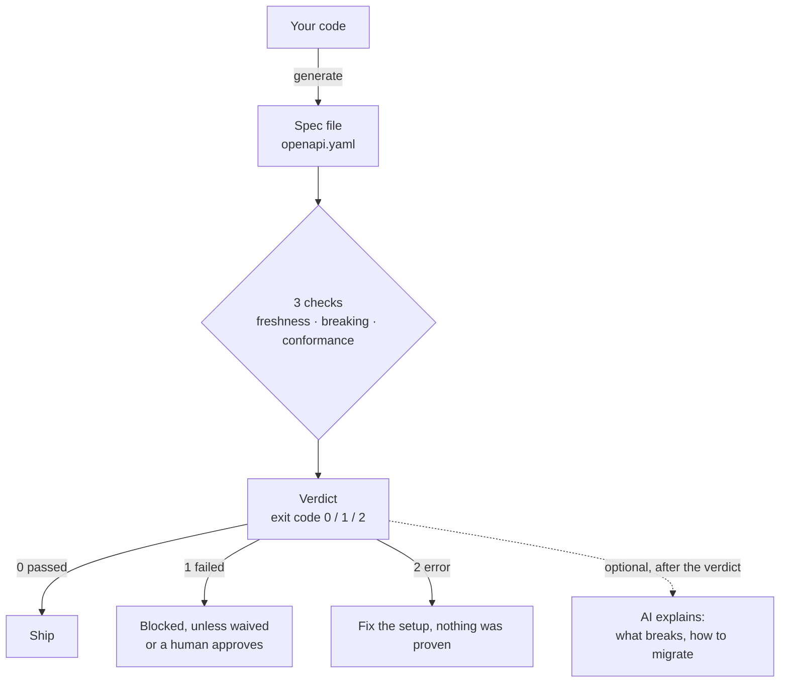

The verdict is fixed **before** any AI runs. Remove the AI entirely and every
build gets exactly the same result.

---

## 2. Spec files: what they are and who makes them

### What a spec file is

An **OpenAPI spec** (usually `openapi.yaml`) is a machine-readable description
of an API: every endpoint, what it accepts and what it returns. A small piece of
the sample project's spec:

```yaml
/users:
  get:
    responses:
      '200':
        content:
          application/json:
            schema:
              items:
                required: [id, name, email]   # every user always has these
```

The spec is the **contract**. It is what clients rely on, and what api-guard
protects.

### Who makes it

Usually **the code generates it**. In the sample project (`sample-api`, Python
with FastAPI):

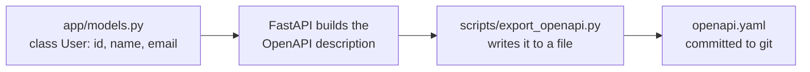

The spec is committed next to the code, so every change to the contract shows
up in the pull request.

### Other languages

api-guard **does not generate specs itself**. It only needs *an* OpenAPI file,
so it works with any stack. You tell it how your project makes one:

| Stack | Common way to produce the spec |
|---|---|
| Python / FastAPI | Built in: `app.openapi()`, as in `sample-api` |
| Java / Spring Boot | springdoc-openapi |
| Node / NestJS | `@nestjs/swagger` |
| Node / Express | swagger-jsdoc |
| .NET | Swashbuckle |
| Go | swag |
| Any | Write `openapi.yaml` by hand |

In `api-guard.yaml`, `generate_cmd` is any shell command that prints the spec.
Or your pipeline generates the file and passes it in with `--generated-spec`.
For a hand-written spec, leave both out: the freshness check is then skipped,
and the other two still run.

---

## 3. The three checks

Each check answers one question, by comparing two things:

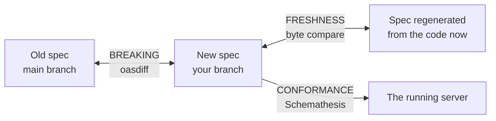

| Check | Question | Compares | Fails when |
|---|---|---|---|
| **Freshness** | Is the committed spec up to date? | committed spec vs. spec regenerated from the current code | Code changed, spec not regenerated |
| **Breaking** | Would clients break? | spec on `main` vs. spec on your branch | A field or endpoint was removed, an input became required, … |
| **Conformance** | Does the real server keep the promise? | the spec vs. real responses from the running server | The server returns something the spec doesn't allow |

### Freshness

api-guard gets a freshly generated spec (by running `generate_cmd`, or from
`--generated-spec`) and compares it **byte for byte** with the committed
`openapi.yaml`. Any difference means someone changed the code and forgot to
regenerate. If the only difference is Windows vs. Unix line endings, the error
message says so, because that's the usual cause on Windows.

**Why it runs at all:** the breaking check only compares spec files. If you
delete `email` in the code but don't regenerate the spec, both spec files still
contain `email`, and the breaking check happily says "no changes". Freshness is
what makes the other checks trustworthy.

### Breaking, and what oasdiff is

**oasdiff** is an open-source tool (a single Go program) that compares two
OpenAPI files and lists every difference that could break a client, using
hundreds of built-in rules.

How api-guard uses it:

1. Read the **old** spec from git: `git show origin/main:openapi.yaml`. Nothing
   gets checked out. `spec.base` can also be a file path or a URL, and
   `--base` overrides it for one run.
2. Take the **new** spec from your working tree.
3. Run `oasdiff breaking old new --format json`.
4. Remove any changes covered by a **waiver** (section 5).
5. Anything left at or above the threshold (`ERR` by default) **fails** the
   check.

Each reported change looks like this (a real one from the sample project):

| Field | Example | Meaning |
|---|---|---|
| `id` (rule) | `response-required-property-removed` | What kind of break |
| `operation` + `path` | `GET /users` | Where |
| `text` | "removed the required property `items/email`…" | Plain description |
| `severity` | `ERR` | `ERR` blocks; `WARN` only warns unless `fail_on: WARN` |
| `fingerprint` | `631dbccdc316` | A unique ID for this exact change |

The **fingerprint** stays the same even if the spec file is reformatted, which
is why waivers use it.

One trap handled for you: `oasdiff breaking` exits with code 0 even when it
finds breaking changes, unless told otherwise. api-guard never trusts that exit
code. It reads the JSON and decides itself.

### Conformance

The only check that talks to a **live server**. Schemathesis, an open-source
API testing tool, reads the spec, generates lots of requests from it (50 per
endpoint by default, the same ones every run), sends them to the running API,
and checks each response:

- no 5xx server errors
- responses match the schema in the spec
- status codes are ones the spec lists

It catches what the other two can't: the spec didn't change, but the code
drifted, e.g. returning `null` for a required field. If the server isn't
reachable at all, that's reported as an **error**, not a contract failure,
because nothing was actually tested.

---

## 4. The verdict: pass, fail or error

Each check ends as `passed`, `failed`, `skipped` or `error`. They are combined
by these rules, in this order:

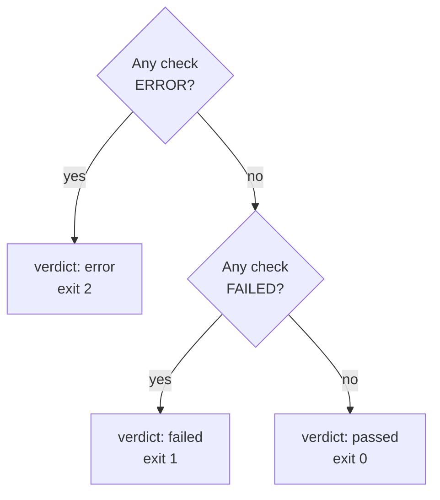

| Exit code | Means | Typical cause |
|---|---|---|
| `0` | Contract intact, or every break waived | Additive change, sunset kept |
| `1` | Would break consumers | Unwaived breaking change, stale spec, server drift |
| `2` | api-guard couldn't reach a conclusion | Bad config, oasdiff missing, API unreachable, a waiver set too far ahead |

**Why 1 and 2 are kept apart:** a typo in a URL reported as "breaking change
detected" sends people hunting for a change that doesn't exist, and after that
happens twice they stop trusting the gate.

When a check is **skipped** instead of failed:

| Situation | Result |
|---|---|
| No `generate_cmd` and no `--generated-spec` | Freshness skipped: the spec is assumed hand-written |
| No old spec yet (first build, or the spec is new on this branch) | Breaking skipped: nothing can have broken |
| No `runtime:` section in the config | Conformance skipped |
| Left out with `--only` | Skipped |

---

## 5. Allowing a breaking change on purpose

Requirements change. The gate's job is to stop breaks **nobody noticed**, not
every break. There are three ways through:

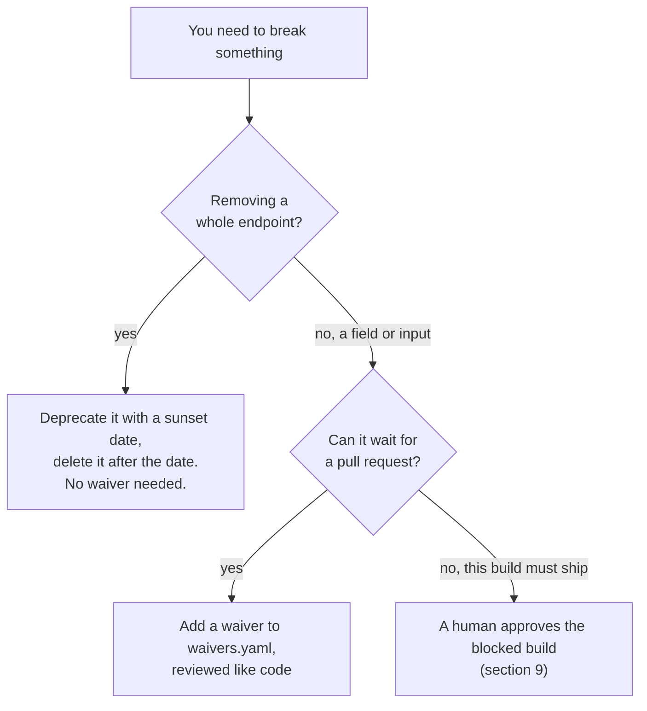

### Retiring an endpoint: deprecation + sunset

```yaml
paths:
  /users/search:
    get:
      deprecated: true
      x-sunset: '2027-03-01'
```

Ship that. Delete the endpoint after the date and the gate stays green.
Deleting it **before** the date fails with `api-path-removed-before-sunset`.
oasdiff also checks the sunset date gives enough notice: 180 days for stable
endpoints and 30 for beta, by default.

Sunset dates only apply to **endpoints**. For a response **field**, the
breaking moment is making it optional (required → optional). Once it's
optional, deleting it is free. So a field rename is: add the new field → make
the old one optional (needs a waiver) → delete the old one later.

### Waivers: what they are and why they exist

**What:** a waiver is one entry in a file, `waivers.yaml`, that says: *"this
specific break is on purpose, here's why, here's who agreed, and here's when
this permission ends."* The gate then lets that one change through, and only
that one.

**Why they exist:** sometimes a break is the right call. A field is being
replaced, every client has already migrated, or a security fix forces it.
Without waivers the team's only options would be to turn the gate off or push
past it, and a gate people routinely bypass stops being a gate. A waiver is the
honest route: the break is allowed, **and** it is written down, reviewed and
time-boxed.

**api-guard doesn't know whether a break is a mistake or on purpose.** It only
knows "something clients rely on was removed". A person decides which, and the
waiver is how they say so.

#### A waiver, start to finish

The company decides users get `phone` instead of `email`. Priya makes the
change on a branch.

**1. api-guard blocks it.** The breaking check compares the spec on `main` with
the spec on her branch, sees `email` is gone, and prints:

```
FAILED  breaking  1 breaking change(s) at or above ERR
  [ERR] GET /users: removed the required property `email` from the response
Fingerprints for waivers:
  631dbccdc316  # response-required-property-removed
```

Exit code 1, so the pipeline stops before anything is published or deployed.

**2. Priya decides.** If removing `email` was a mistake, she fixes the code and
no waiver is needed. If it's on purpose, she adds to `waivers.yaml` in the
project's repo:

```yaml
- fingerprint: "631dbccdc316"          # copied from the failure output
  id: response-required-property-removed
  path: /users
  reason: "PROD-142: switching to phone. Web v5 and mobile v3 no longer read email."
  approved_by: priya
  expires: 2026-12-31
```

**3. Teammates review it.** The pull request now shows the code change *and*
the waiver with its reason. If someone knows a client that still reads
`email`, they object and it isn't merged. **This review is the human check.**
api-guard makes sure the reason exists and is visible; people judge whether
it's true.

**4. api-guard passes.** On the next run the same break is found, its
fingerprint matches the waiver, it's removed from the list, nothing is left,
and the result is exit 0: `no breaking changes (1 waived)`. The report still
shows the waived change, so nothing is hidden. The pull request merges and
ships.

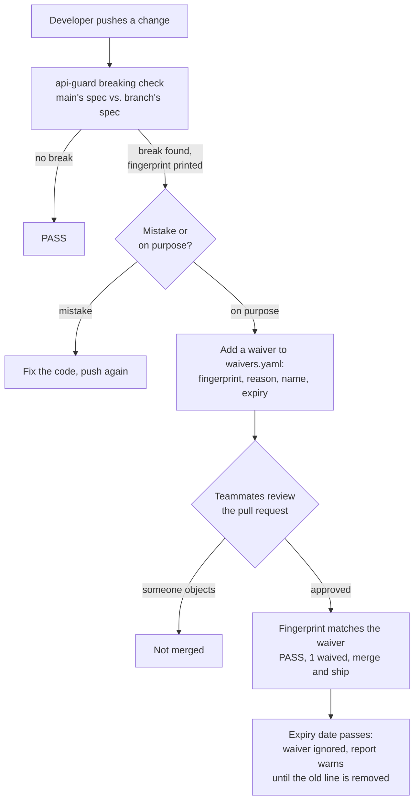

#### Who reads each field

The file has two readers: the machine and people.

| Field | Read by | Used for |
|---|---|---|
| `fingerprint` | **api-guard** | Which break to let through. The matching key |
| `expires` | **api-guard** | After this date the waiver is ignored (the change counts again) and every report warns until the line is removed. At most `max_waiver_days` ahead |
| `reason` | **people** | Why it's OK. api-guard only checks it's a real sentence (at least 10 characters, so "temp fix" is rejected), never whether it's true |
| `approved_by` | **people** | Who takes responsibility. api-guard only checks it isn't empty |
| `id`, `path` | **people** | Optional. Helps a reader see what the fingerprint refers to |

#### Where the fingerprint comes from and where it's used

The fingerprint is **generated by oasdiff**, computed from the change itself:
what kind of change, which endpoint, which field. It isn't random, so the same
change gets the same fingerprint on every run and every machine, and
reformatting the spec doesn't change it.

1. oasdiff finds "email removed from GET /users" and computes `631dbccdc316`.
2. api-guard prints it in the failure output.
3. A person copies it into `waivers.yaml`. This is the only manual step;
   `check --explain` prints a ready-made waiver block with the real
   fingerprints filled in.
4. On the next run oasdiff computes `631dbccdc316` again.
5. The breaking check (`apply_waivers` in `policy.py`) compares each found
   change's fingerprint with the waivers. Matches are removed before the
   verdict. This is the only place fingerprints are used.

`waivers.yaml` lives in **your project's repo** (e.g. `sample-api/waivers.yaml`),
committed like code. `api-guard.yaml` points to it with `policy.waivers`.
api-guard reads it at the start of every run, where it rejects badly written or
expired entries, and again during the breaking check, for the matching.

#### Why waivers expire: an example

After Priya's change merges, `main` has no `email`, so later branches don't see
that change any more. Her waiver sits in the file, unused. Now:

- **2027:** another team adds `email` back, because a new partner integration
  needs it. New clients start depending on it again.
- **2028:** a developer removes `email` again during a refactor. It's the same
  kind of change on the same field and endpoint, so it gets **the same
  fingerprint**, `631dbccdc316`.

| Without expiry | With expiry (2026-12-31) |
|---|---|
| api-guard finds Priya's 2026 waiver, matches it, and **silently lets the break through**. Her reason was about 2026's apps. The 2027 partner integration breaks, and nobody was warned | The waiver stopped working in January 2027, and every report warned "remove this expired waiver". In 2028 the removal is **blocked**, and a person has to look at it fresh |

A waiver is permission for **a situation at a point in time**. Its reason
("these apps are migrated") is only true then. The expiry stops an old
permission from approving a new situation, like a visitor pass instead of a
permanent key.

#### Choosing the expiry date

A person chooses it, up to `policy.max_waiver_days` ahead (default **90**; a
waiver set further out is refused, exit 2). **Set it to the date the reason
stops being true, or the date you've promised to finish.**

| Situation | Good expiry |
|---|---|
| All clients already migrated, just removing the old field | **Short**, e.g. 30 days. It only needs to cover the pull request being merged |
| "Mobile v2 still reads `email`, but v2 is switched off on Nov 30" | **Nov 30**. If v2 isn't gone by then, the build makes someone check |
| A temporary break during a 3-week migration | The end of the migration, plus a few days |
| Not sure | 90 days at most, then look again |

A waiver does its real work **until the pull request is merged**. After that,
`main` already contains the change and the waiver no longer matches anything.
So short dates are safer: the waiver gets the change through review, then
expires and gets cleaned out, and can't be reused by accident later.

#### Other rules

- **Stale waivers** (matching nothing any more, usually because the problem was
  fixed properly or the change is already on `main`) are listed in the report
  but don't fail the build.
- **Expired waivers** are never applied and are listed under "Expired waivers -
  remove them" in every report. They don't fail the build by themselves: a dead
  line in a file is paperwork, not a broken API.
- **A waiver set more than `max_waiver_days` ahead** is refused (exit 2), so a
  waiver can't quietly become permanent.
- **Duplicate fingerprints** in the file are rejected (exit 2).
- **Why not an "ignore list"?** An ignore list lives forever and keeps silently
  hiding every future break on the same field. Waivers are the same idea, but
  written down, reviewed, tied to one exact change, and time-limited.

### Waiver, sunset or approval?

| Way through | For | Lasts |
|---|---|---|
| **Deprecation + sunset** | Removing a whole **endpoint**, planned in advance | No exception needed; you keep the promised date |
| **Waiver** | Any other intended break, e.g. a **field**, decided in a pull request | Until its expiry date |
| **Human approval** (`review` / Jenkins Approve button) | "This build must ship **now**", with no waiver in place | Only **this one build**. The next build blocks again |

---

## 6. Configuration

`api-guard.yaml` lives next to your spec. Only `spec.path` is required; leaving
a section out turns off the check that needs it.

```yaml
spec:
  path: openapi.yaml            # required
  base: "git:origin/main"       # git:<ref> | ./path.yaml | https://...
  generate_cmd: "python scripts/export_openapi.py --stdout"   # enables freshness

runtime:                        # omit to skip conformance
  url: http://localhost:8000
  checks: [not_a_server_error, response_schema_conformance, status_code_conformance]
  max_examples: 50              # generated requests per endpoint
  wait_for_schema: 30           # seconds to wait for the API to start
  deterministic: true           # same requests every run, so failures reproduce

policy:
  fail_on: ERR                  # ERR | WARN
  deprecation_days_stable: 180
  deprecation_days_beta: 30
  severity_levels: null         # optional oasdiff rule-tuning file
  waivers: waivers.yaml
  max_waiver_days: 90           # a waiver may expire at most this far ahead

report:
  dir: api-guard-report
  formats: [markdown, json, junit]   # json is required: other tools read it
```

Unknown keys are rejected on purpose: a typo like `fail_on: EROR` that silently
weakened the gate would be worse than refusing to start.

---

## 7. Reports

Every run writes to `api-guard-report/`:

| File | For |
|---|---|
| `report.md` | People. The summary, plus the AI explanation if `--explain` is used |
| `result.json` | Tools. The MCP server and the agent read this; it has a `schema_version` |
| `junit.xml` | CI dashboards (Jenkins' test results page) |
| `review.md` | Written by `review`/`approve`: the decision, the approver, the risk label |
| `approval-request.md` | Only present while a review is waiting for a human. CI checks for it |

---

## 8. The AI layer

### The rule everything follows

> **Rules decide. AI explains.**

A build gate has to give the same answer every time, can't depend on a
provider being up, and can't be talked out of its decision by clever text in a
pull request. An LLM can't promise any of that. So every AI feature runs
**after** the verdict is fixed, and if it fails (no key, provider down,
malformed answer) it quietly steps aside. Tests enforce this: the modules that
decide pass/fail aren't allowed to import any AI code.

The AI layer is an optional install (`pip install ".[ai]"`) and runs on a
**free Groq API key**. Nothing needs a paid service.

### The pieces

| Piece | Command | What it does | Model (default) |
|---|---|---|---|
| **Explain** | `check --explain` | Writes "what breaks, how to migrate, draft waiver" into `report.md` | `gpt-oss-120b` |
| **Triage** | inside `review` | Labels a blocked change `routine` / `risky` / `unknown` for the approver | `gpt-oss-20b` |
| **Review workflow** | `review`, `approve` | Pauses a blocked build for human sign-off (LangGraph, section 9) | uses triage |
| **Agent** | `ask` | Answers questions about past builds by choosing which tools to read (section 10) | `gpt-oss-20b` |
| **MCP server** | started by `ask` | Serves build results as read-only tools | none, no AI |
| **Web page** | `ui` | `ask` in a browser | same as `ask` |

### One shared model layer (`llm.py`)

Every model call goes through `src/api_guard/ai/llm.py`. It holds:

- **A model per job** (triage, explain, agent), each with its own setting.
- **The key**, loaded once (environment, or `.env` for local use).
- **The rate-limit fallback.** If a model is still rate-limited after retries,
  the call is tried once on the other Groq model: same free key, but Groq's
  limits are per model. If both are limited, the report shows the rule-based
  facts without AI text.
- **One copy of the project's rules** (sunsets, field demotion needs a waiver,
  the exact waiver keys), used by every prompt. Before, three hand-kept copies
  had drifted apart.
- **The prompt-shrinking helpers** described in section 12.

`AI_PROVIDER` selects the provider; `groq` is the only one implemented.
Everything above it (prompts, agent loop, MCP tools) works through LangChain's
standard chat-model interface, so adding another free provider is a change in
this one file.

### What the model sees, and what it doesn't

The model **never sees your spec file or your code**. It gets the short list of
changes oasdiff already found (repeats merged, at most 8, worst first) and is asked to
**explain** them, not to work out what broke. The facts come from the rules.
The model adds plain English.

Other safeguards:

- **Structured answers.** Explain and triage ask for fixed fields (`impact`,
  `migration`, `band`), validated with Pydantic. If explain's structured answer
  fails, it falls back to plain text rather than nothing.
- **The project's rules are in the prompt** (use `deprecated: true`, not
  `x-deprecated`; demoting a field needs a waiver), from the one shared copy
  in `llm.py`, so the model doesn't guess them.
- **JSON-schema mode for structured answers.** The gpt-oss models mangle tool
  names in tool-calling mode, so `llm.py` picks the mode each model handles
  reliably.
- **Fingerprints are never written by the model.** The draft waiver in the
  report uses the real ones, since a made-up fingerprint would silently match
  nothing.
- **`temperature=0`**, for answers as repeatable as possible.

---

## 9. LangGraph: the review and approval workflow

### Where it's used

LangGraph is used in **one place**: `api-guard review` and `api-guard approve`.
`check`, `--explain` and `ask` don't use it (`ask` uses a separate small graph
for its tool loop, see section 10).

### Why a workflow library at all

A blocked build may need a human, and that human may answer hours or days
later. A plain script would have to either **sit and wait** (blocking a CI
machine the whole time) or **forget everything** when it stops. LangGraph
saves the workflow's state after every step (a *checkpoint*, stored in SQLite
at `.api-guard/reviews.db`) and can **resume in a completely different
process**, exactly where it paused.

### The workflow

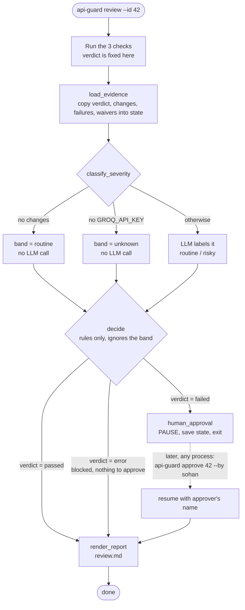

**The conditions, exactly:**

| Step | Condition | Result |
|---|---|---|
| decide | verdict is `failed` or `error` | `blocked = true` |
| decide | verdict is `failed` | `needs_approval = true`: go to human_approval |
| decide | verdict is `error` | blocked, **no** approval: a tooling failure proved nothing, so there's nothing to sign off |
| decide | verdict is `passed` | straight to the report |
| human_approval | approver gives a name | recorded in `review.md` as "Approved to ship by …" |
| approve | empty name | refused |
| approve | review already finished, or unknown ID | refused, exit 2 |

**The design rule, tested:** `decide` only reads the rule-based verdict. It
never reads the model's band, even though the band sits right next to it in the
state. A test checks this by inspecting the code, and another removes the LLM
step entirely and confirms the decision doesn't change.

### What is saved at each step

| After step | Saved in the state |
|---|---|
| load_evidence | build label, verdict, list of changes, conformance failures, waivers applied |
| classify_severity | `band`, `rationale` |
| decide | `blocked`, `needs_approval` |
| human_approval | `approved_by` |
| render_report | the final `report` text |

A test runs the pause in one Python process and the approval in a
**brand-new process** that shares only the SQLite file, and confirms the
earlier steps didn't run again.

### What approval does and doesn't do

- It **does** record who signed off, in `review.md`.
- It **doesn't** change the verdict or `result.json`. Whether a signed-off
  failure may ship is the pipeline's decision. In Jenkins, an approved build
  ships and finishes **UNSTABLE** (yellow), because the test report still
  lists the breaks.
- **Rejecting** today happens in the CI system (Jenkins' Abort button, or
  simply never approving). The saved review stays paused. See
  [Known gaps](#20-known-gaps).

---

## 10. The agent: `ask`, MCP and the tool loop

### What makes it an agent

`api-guard ask "why did build 1 fail?"` doesn't follow a fixed script. The
model reads the question and the list of available tools, **chooses** which to
call, reads the results, decides whether it needs more, and stops when it can
answer. Different questions lead to different paths, e.g.:

- "Why did build 1 fail?" → `get_build_context` → `get_report`
- "Did it fail conformance too?" → `get_build_context` → `get_conformance_results` → `get_spec_diff`
- "Which waivers expire soon?" → `list_expiring_waivers`

That choose → act → look → repeat loop is what "agentic" means. The rest of
api-guard is deliberately **not** agentic: the parts that decide things are
fixed rules.

### The loop

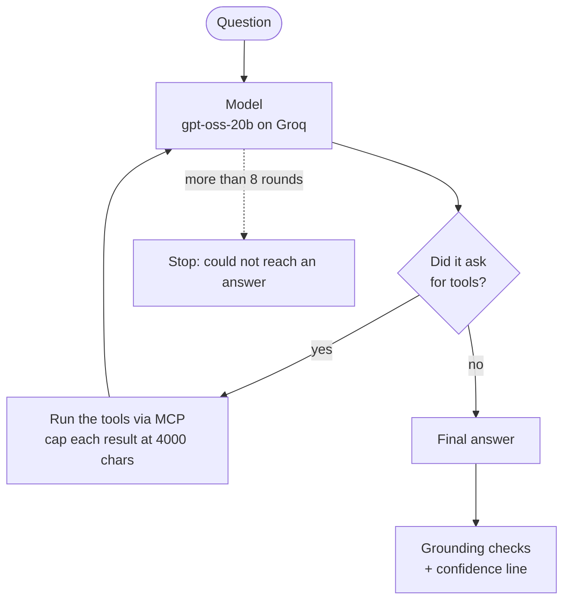

### MCP, and why it's there

**MCP (Model Context Protocol)** is an open standard for connecting AI agents
to tools. Think of it as a universal plug: a tool written once as an MCP
server can be used by **any** agent that speaks MCP, whatever model or
framework that agent runs on.

**Low coupling is the point.** Without MCP, each tool would be written against
one agent framework and one provider's tool format. Switching providers would
mean rewriting every tool. With MCP:

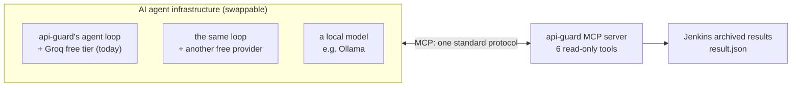

- **Tools don't know which model calls them.** The MCP server has no AI in it
  at all. It just answers tool calls.
- **Agents don't know how tools work inside.** They see each tool's name,
  description and inputs, and nothing else.
- **One unified way in.** api-guard's own agent, a different agent framework,
  or a local model all reach the same six tools the same way, so the tools are
  written and tested once.
- **Adding a tool** means adding it to the server. Every agent sees it
  automatically, with no change to agent code.

api-guard's MCP server (`python -m api_guard.ai.mcp_server`) offers six
**read-only** tools. Each reads the `result.json` that Jenkins archived for a
build:

| Tool | Returns |
|---|---|
| `get_build_context` | verdict, exit code, commit, branch, Jenkins status |
| `get_report` | the full result |
| `get_spec_diff` | the breaking changes oasdiff found |
| `get_conformance_results` | where the running API disagreed with the spec |
| `get_freshness_result` | whether the committed spec matched the code |
| `list_expiring_waivers` | waivers expiring within N days (default 30) |

The build ID `local` reads `api-guard-report/result.json` in the current folder
instead of Jenkins.

**Why MCP instead of calling the functions directly:** it keeps the three parts
of the agent separate, so each can change without touching the others:

| Part | Is | Change it by |
|---|---|---|
| **Tools** | the MCP server | editing `mcp_server.py`; the agent picks up new tools automatically |
| **Model** | `gpt-oss-20b` on Groq's free tier | setting `GROQ_AGENT_MODEL`; the loop is built on LangChain's standard chat-model interface, so moving to another free provider is a small change |
| **Loop** | api-guard's own LangGraph code | owned by us, independent of the provider |

### Guards on the loop

| Guard | Stops |
|---|---|
| **Max 8 rounds** of tool calls | Endless looping |
| **Max 12 tool calls in total** | One round asking for many tools at once |
| **Repeat detection**: the same tool with the same inputs isn't run again; the model is told it already has the result | Wasted calls and tokens from a model going in circles |
| **Conversation budget** (~6000 tokens): older tool results are shortened before the next model call, the newest kept whole | Outgrowing the free tier's per-minute limit on long investigations |
| **Read-only tools only** | Harm from a tricked model: pull request text can contain "ignore your instructions", but there is nothing it could make the agent change |
| **Tool output treated as data**, as the prompt tells the model | Prompt injection steering the answer |
| **Each tool result capped at 4000 characters** | Huge inputs that slow the model and burn tokens |
| **Empty results sent as "(no results)"** | Groq rejects empty tool messages |
| **Tool errors passed back to the model** | Crashes on a bad build ID |
| **Up to 4 retries on rate limits**, waiting as long as Groq says, then that one call moves to the other Groq model | Groq's free tier limits (HTTP 429) |
| **Never part of the gate** | An AI failure affecting a build |

### Honest answers

Every answer ends with:

- **The model's own confidence**: high / medium / low, with a reason. It is
  **not calibrated**: models call wrong answers "high" too, which is why it's
  never shown alone.
- **Checks api-guard runs itself** (no model involved):
  - any fingerprint or rule ID in the answer that never appeared in the tool
    output is flagged "possibly made up"
  - tool errors are counted
  - an answer given without reading any build data is flagged
- **A caution label:** the answer is model-written, may be wrong, and can't
  change a verdict.

The model is also told to mark guesses as guesses ("possibly…"). Small models
only partly follow this, which is why the checks above exist.

---

## 11. Limits, retries and timeouts

| What | Limit | Where set |
|---|---|---|
| `generate_cmd` run time | 120 s | freshness check |
| oasdiff run time | 120 s | breaking check |
| Reading the old spec from git or a URL | 30 s | specs |
| Waiting for the API to start | 30 s (`wait_for_schema`) | config |
| Schemathesis run time | 900 s | conformance check |
| Generated requests per endpoint | 50 (`max_examples`) | config |
| Conformance failures listed in the report | 10 distinct problems | conformance check |
| Changes sent to the model | 8, repeats merged, worst first | explain, triage |
| Prompt size | ~1500 tokens (triage), ~2500 (explain) | trimmed before sending |
| Model call timeout | 45 s | all AI calls |
| Retries: explain / triage | 1, then the other Groq model once | then skipped quietly (facts only) |
| Retries: agent | 4, honouring Groq's retry-after, then the other Groq model for that call | then a clear "rate limit" message |
| Agent tool rounds | 8 | then "stopped without an answer" |
| Agent tool calls in total | 12 | then told to answer with what it has |
| Agent conversation size | ~6000 tokens | older tool results shortened |
| Waiver expiry | `max_waiver_days`, default 90 | further out is refused (exit 2) |
| Characters per tool result | 4000 | agent |
| Fetching from Jenkins (MCP) | 20 s | MCP server |
| Jenkins: build and gate stage | 30 min | Jenkinsfile |
| Jenkins: waiting for approval | 24 h (`API_GUARD_APPROVAL_HOURS`) | then the build fails |
| Jenkins: ship stage | 30 min | Jenkinsfile |

---

## 12. How tokens are saved

Groq's free tier allows a limited number of tokens per minute, so the AI layer
is built to stay small:

- **No AI when there's nothing to say.** A passing build with no changes makes
  no model call. No key means no call either.
- **Facts, not files.** The model gets a pre-filtered list of changes, never
  the full spec (often hundreds of lines).
- **At most 8 changes per prompt**, worst first, with repeats merged: the same
  rule on the same endpoint is sent once, with a count.
- **Budget checked before sending.** Each prompt's size is estimated first and
  trimmed to fit (about 1500 tokens for triage, 2500 for explain), instead of
  finding out from a rate-limit error.
- **Fingerprints stay out of prompts.** The model never needs them, so they
  aren't paid for.
- **The small model where it's enough.** Triage and the agent use
  `gpt-oss-20b`; only the written explanation uses `gpt-oss-120b`. Each role
  has its own setting.
- **Tool results capped** at 4000 characters, because every agent round
  resends the whole conversation, and **older results shortened** once the
  conversation passes about 6000 tokens.
- **No repeated tool calls.** The agent is told it already has a result instead
  of fetching it again.
- **A second model, not a second provider.** On a rate limit, the other Groq
  model on the same key takes the call. No other sign-up needed.
- **Few retries** for one-shot calls (1), so a failing provider isn't hammered.
- **Everything optional.** A team that doesn't want AI never installs it.

Each person or team uses **their own** free key, so the limits apply per user
and one team's usage doesn't slow down another's.

---

## 13. Docker

### Why an image

api-guard depends on two outside tools written in different languages:
**oasdiff** (Go) and **Schemathesis** (Python), plus **git**. The Docker image
bundles all of them at pinned versions, so nobody has to install anything, and
every machine and every CI system runs exactly the same thing.

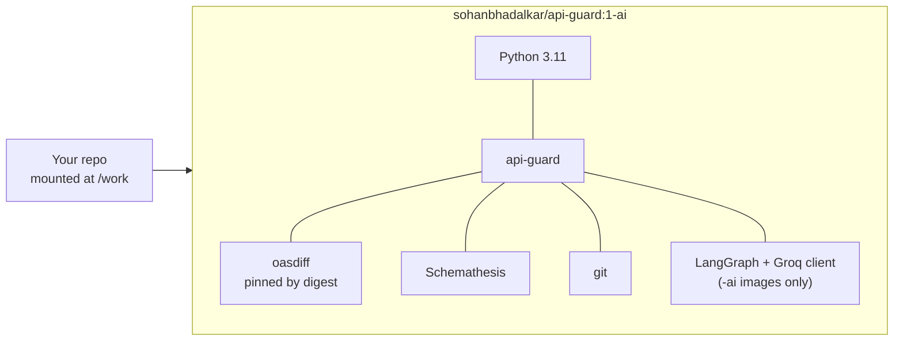

| Image | Contains | Use for |
|---|---|---|
| `sohanbhadalkar/api-guard:1` | the gate | `check` only |
| `sohanbhadalkar/api-guard:1-ai` | the gate + AI layer | `check --explain`, `review`, `approve`, `ask` |

`:1` means "latest 1.x". You get fixes without breaking changes.

```bash
docker run --rm -v "$PWD:/work" -w /work sohanbhadalkar/api-guard:1-ai check
```

### The one catch: generating the spec

The image contains api-guard's tools, **not your project's dependencies**. It
can't run a FastAPI or Spring export script. So in CI, generate the spec where
your project's dependencies live (its own build step or container), then hand
the file to api-guard:

```bash
python scripts/export_openapi.py --output generated.yaml     # in your project's environment
docker run --rm -v "$PWD:/work" -w /work sohanbhadalkar/api-guard:1-ai \
  check --generated-spec generated.yaml
```

---

## 14. CI and CD

- **CI (Continuous Integration):** every change is automatically built and
  checked. Question: *is this change safe?*
- **CD (Continuous Delivery/Deployment):** changes that pass are automatically
  packaged and deployed. Question: *get it running.*

api-guard is a **CI gate that protects CD**: it runs before anything is
published, so a breaking change never becomes a deployable artifact.

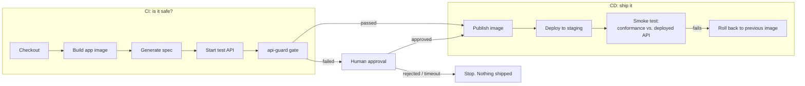

| Pipeline | CI part | CD part |
|---|---|---|
| `sample-api` in Jenkins | checkout, build, generate spec, test API, gate, approval | publish image, deploy to staging, smoke test, rollback |
| `sample-api` in GitHub Actions | the gate only | none |
| api-guard's own `ci.yml` | unit tests, plus the full suite inside the image with real oasdiff | none |
| api-guard's own `release.yml` | tests, and proving the built image works | on a version tag (`v1.2.3`): push the image to Docker Hub as `1.2.3`, `1.2`, `1`, `latest` |

---

## 15. Running in Jenkins

**In short: Jenkins checks the change, lets a human approve a blocked build,
and deploys.**

```
BUILD AND GATE
1. Check out the code (+ origin/main, to compare against)
2. Build the app's Docker image
3. Generate the spec, inside the app's image
4. Start a temporary copy of the app
5. api-guard review
     exit 0 → go to SHIP
     exit 1 → go to APPROVAL
     exit 2 → stop (setup problem, no approval offered)

APPROVAL (only if blocked)
6. Wait up to 24 h for a human:
     Approve + name            → api-guard approve → go to SHIP
     Abort / no name / timeout → stop, nothing shipped

SHIP
7. Push the image to Docker Hub (only if the credential exists)
8. Deploy to staging
9. Smoke test: conformance against the deployed app
     fails → roll back to the previous version
```

`sample-api/Jenkinsfile` is the full example. It has three top-level stages, so
**no Jenkins executor is held while waiting for a human**:

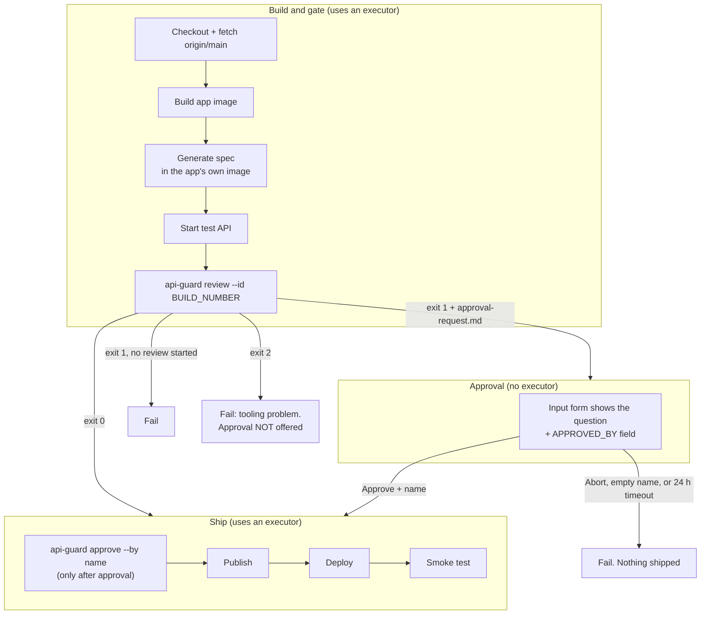

Things worth knowing:

- **Builds of `main` compare against what's deployed.** On a branch, the
  breaking check compares with `origin/main`. On `main` itself that would be the
  same commit, so the check could never find anything. The pipeline passes
  `--base` with the last commit that passed on this job
  (`GIT_PREVIOUS_SUCCESSFUL_COMMIT`), or the previous commit on a first build.
  Approved builds end UNSTABLE, not SUCCESS, so they're never used as the base:
  an approved break keeps being reported on `main` until its waiver is
  committed.
- **The pause survives a Jenkins restart.** Jenkins resumes the waiting build,
  and api-guard's saved review is in the workspace.
- **Reports are archived** on every build, pass or fail. The MCP server (and so
  `ask`) reads `result.json` from those archives.
- **Sibling containers.** Jenkins drives the host's Docker, so containers it
  starts are siblings, not children. `--volumes-from jenkins-local` gives them
  the same paths as Jenkins' workspace.
- **Settings on the Jenkins machine:** `API_GUARD_IMAGE` (which image to use),
  `API_GUARD_PULL`, and `API_GUARD_APPROVAL_HOURS`.
- **Optional Groq key:** add a `groq-api-key` secret-text credential and the
  approval question includes the risk label.
- **Publishing needs a `dockerhub` credential.** Without it, publish and deploy
  are skipped and the gate still runs.

### Local lab

`jenkins-local/` runs Jenkins in Docker at http://localhost:8081, plus a small
`git-local` server. The `sample-api-local` job builds branches straight from
your local checkout, so pipeline changes can be tried without pushing. Staging
runs at http://localhost:8080.

---

## 16. Running in GitHub Actions

**In short: GitHub Actions only checks the change.** No deploy, no approval
step. `sample-api/.github/workflows/api-guard.yml` runs on every push to `main`
and on every pull request:

```
1. Check out the code (full history, so origin/main exists)
2. Install the app's dependencies
3. Generate the spec from the code   → generated.yaml
4. Start the app                     (docker compose)
5. Run api-guard                     → freshness + breaking + conformance
     pass → green ✓
     fail → red ✗, report posted as a pull request comment
6. Stop the app
```

The difference in one line: **GitHub Actions checks. Jenkins checks, lets a
human approve, and deploys.**

api-guard is also a GitHub Action (`action.yml` in this repo):

```yaml
- uses: actions/checkout@v4
  with:
    fetch-depth: 0              # required: a shallow clone has no origin/main
- run: python scripts/export_openapi.py --output generated.yaml
- run: docker compose up -d     # start the API for conformance
- uses: stimpy3/ApiGuard@main
  with:
    config: api-guard.yaml
    generated-spec: generated.yaml
    url: http://localhost:8000
```

The action runs the `:1` image and then:

- fails the step with the gate's exit code
- adds `report.md` to the job summary
- posts `report.md` as a pull request comment (turn off with `comment: 'false'`)
- uploads `api-guard-report/` as an artifact
- exposes outputs `verdict` (passed / failed / error) and `report`

Other inputs: `only` (which checks), `version` (image tag, default `1`).

GitHub Actions can't pause a job for days and wait for a person, so there's no
approval step there. Use a waiver, or approve with the CLI.

---

## 17. Command reference

Full flags: `api-guard <command> --help`.

### Install

```bash
pip install -e ".[cli]"            # the gate (the breaking check also needs oasdiff on PATH)
pip install -e ".[cli,ai]"         # + explain, review/approve, ask
pip install -e ".[cli,ai,ui]"      # + the web page
```

Or skip installing entirely and use Docker (section 13).

### The gate

| Command | Example | Use it when |
|---|---|---|
| `check` | `api-guard check` | Run all three checks against `./api-guard.yaml` |
| `--config` | `api-guard check --config path/to/api-guard.yaml` | The config isn't in the current folder |
| `--generated-spec` | `api-guard check --generated-spec generated.yaml` | Your pipeline already exported the spec |
| `--only` | `api-guard check --only breaking` | Run only some of `freshness`, `breaking`, `conformance` |
| `--url` | `api-guard check --only conformance --url http://localhost:8080` | Test a different running API, e.g. staging after deploy |
| `--base` | `api-guard check --base git:a1b2c3d` | Compare against a different spec than `spec.base`, e.g. the last deployed commit when building `main` |

### AI features (need `GROQ_API_KEY`)

| Command | Example | Use it when |
|---|---|---|
| `--explain` | `api-guard check --explain` | You want "what breaks, how to migrate" in `report.md` |
| `ask` | `api-guard ask "why did build 42 fail?"` | Investigating a Jenkins build |
| `ask --job` | `api-guard ask "did build 1 fail conformance?" --job 'sample-api-local/job/main'` | The build is in another Jenkins job (branch names with `/` need `%252F`) |
| `ask` (local) | `api-guard ask "what failed in build local?"` | Asking about `result.json` in the current folder |
| `ui` | `api-guard ui` | `ask` in a browser, at http://localhost:8501 |

### Approval

| Command | Example | Use it when |
|---|---|---|
| `review` | `api-guard review --id 42` | Same as `check`, but a blocked build pauses for sign-off |
| `approve` | `api-guard approve 42 --by sohan` | Someone decides to ship the break; writes `review.md` |
| `--state` | `api-guard review --id 42 --state /shared/reviews.db` | The saved review must outlive the workspace (use the same path with `approve`) |

### MCP server

```bash
python -m api_guard.ai.mcp_server      # ask starts this by itself
```

### Running the tests

The most reliable way is inside the image, which has the real oasdiff, so
nothing is skipped (the same as CI):

```bash
docker build --build-arg EXTRAS=cli,ai -t api-guard:local-ai .
docker build -t api-guard:pytest - <<'EOF'
FROM api-guard:local-ai
RUN pip install --no-cache-dir pytest "streamlit>=1.40"
WORKDIR /src
ENTRYPOINT ["python", "-m", "pytest"]
EOF
docker run --rm -v "$PWD:/src" -e PYTHONPATH=/src/src api-guard:pytest -q -p no:cacheprovider
```

Tests never call a real model: `tests/conftest.py` sets `AI_PROVIDER=off`, even
when a real key sits in `.env`.

---

## 18. Settings

Set as environment variables, or in a `.env` file (never committed).

| Variable | Default | Used by |
|---|---|---|
| `GROQ_API_KEY` | none | every AI feature |
| `AI_PROVIDER` | `groq` | which provider `llm.py` uses; `groq` is the only one implemented, anything else turns AI off |
| `GROQ_MODEL` | `openai/gpt-oss-120b` | `--explain` |
| `GROQ_CLASSIFY_MODEL` | `openai/gpt-oss-20b` | triage in `review` |
| `GROQ_AGENT_MODEL` | `openai/gpt-oss-20b` | `ask`, `ui` |
| `JENKINS_URL` | `http://localhost:8081` | `ask`, MCP server |
| `JENKINS_JOB` | `sample-api` | `ask`, MCP server |
| `JENKINS_USER`, `JENKINS_TOKEN` | none | only if Jenkins needs a login |
| `API_GUARD_OASDIFF` | found on PATH | a different oasdiff binary |

Groq retires models on a schedule. Check its deprecations page before changing
a model name.

---

## 19. Project layout

```
api-guard/
├── src/api_guard/
│   ├── cli.py              commands and exit codes
│   ├── config.py           api-guard.yaml
│   ├── specs.py            reading the old spec (git / file / URL)
│   ├── checks/
│   │   ├── freshness.py    committed vs. regenerated spec
│   │   ├── breaking.py     oasdiff + waivers
│   │   └── conformance.py  Schemathesis against the live API
│   ├── policy.py           waivers: loading, expiry, matching
│   ├── verdict.py          combining checks into one verdict   ← no AI allowed
│   ├── report.py           report.md / result.json / junit.xml
│   └── ai/                 everything optional
│       ├── llm.py          every model call: roles, key, fallback, shared rules
│       ├── explain.py      --explain
│       ├── graph.py        the LangGraph review workflow
│       ├── review.py       review / approve, SQLite state
│       ├── evidence.py     where the workflow gets its facts
│       ├── agent.py        ask: the tool-calling loop
│       ├── mcp_server.py   the 6 read-only tools
│       └── ui.py           the web page
├── tests/                  includes the "AI can't touch the verdict" tests
├── action.yml              the GitHub Action
├── Dockerfile              the images
└── jenkins/vars/           a Jenkins shared-library step
```

---

## 20. Known gaps

Stated plainly, so nobody discovers them the hard way:

- **Rejecting a review** happens only in the CI system. The LangGraph workflow
  has no reject route yet, and no "ask a question" loop for the approver.
- **The approver sees the risk label, not the full explanation.** `--explain`
  and the review workflow are separate paths.
- **Approval doesn't create a waiver**, so the same break blocks again on the
  next build.
- **Only Groq is implemented** as a provider. `llm.py` is the single place
  another free provider would be added.
- **The shared Jenkins library** (`jenkins/vars/apiGuard.groovy`) runs `check`
  only, without approval.
- **The breaking check needs oasdiff**, which the Docker image has. Locally
  without it, 13 tests are skipped. CI runs them inside the image.

See [CHANGELOG.md](CHANGELOG.md) for what changed in each release.
